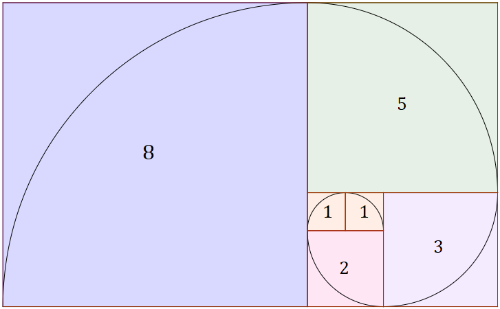

  

# Fibonacci usando NodeJS

Faça um método `fibonacci` que retorne um `Array` com os primeiro números de série de *Fibonacci* até passar de *350*.

> A série de Fibonacci é a seguinte: 0, 1, 1, 2, 3, 5, 8, 13, etc...

Faça um segundo método `"isFibonnaci"` que recebe um `Number` como parâmetro e retorne `Boolean`.
Caso o número recebido por parâmetro esteja entre os números da sequência de *Fibonnaci* do `"fibonnaci"` retorne `true`, senão, `false`.

## Tópicos

Neste desafio você aprenderá:

- Variáveis e métodos
- Operadores matemáticos
- Controle de fluxo
- Listas

## Requisitos
​
Para este desafio você precisará :

- NodeJS LTS (8.12.0+)

Para instalar, confira os links na seção de conteúdo.

Obs.: Tente usar o mínimo de bibliotecas possível

## 📝 Licença

Esse projeto está sob a licença MIT. Veja o arquivo [LICENSE](https://raw.githubusercontent.com/kaiorr/aceleraDevReact/master/LICENSE) para mais detalhes.

----

Feito com :heart: por **Kaio Ribeiro** :call_me_hand: [Professional Network](https://www.linkedin.com/in/kaio-ribeiro-310123150/)