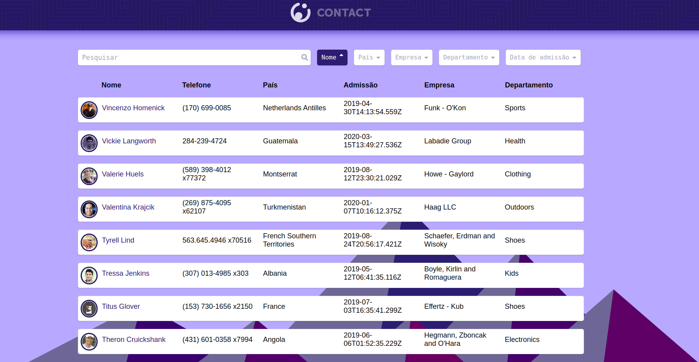

  

# SPA: App de Contatos - PARTE 1

## Objetivo:
O desafio é desenvolver um *SPA (Single Page Application)* de uma lista de contatos em **React** com as seguintes funcionalidades:

-  Consumir os dados de contato através de uma API Rest, usando a *Fetch API* do Javascript.
-  Busca de um contato aplicando filtro em **tempo real**.
-  Aplicar filtros de ordenação por *Nome*, *País*, *Empresa*, *Departamento* e *Data de Admissão*.

### API de Contatos:

GET: *https://5e82ac6c78337f00160ae496.mockapi.io/api/v1/contacts*

### Requisitos - Parte 1:

- Modularize os componentes na pasta components.
- Atualize os arquivos de componentes carregando corretamente seus estilos e suas marcações JSX.

### Iniciar o projeto:

- Instale as dependências do projeto com o comando *yarn install* ou *npm install*.
- Inicie o projeto com comando *yarn start* ou *npm start* / *npm run start*.

**Preview:**

[Contacts SPA](https://vimeo.com/414861574/cb0d443103)

## Tópicos:

Neste desafio você vai praticar os seus conhecimentos em:

- **React**
- **Modularização**

## Requisitos:

* **[Node v13.8.0](https://nodejs.org/en/)** - ou superior, instalado em seu computador.
* **[Create React App](https://github.com/facebook/create-react-app)**

## Screenshot de Referência

## 🤔 Como Contribuir

**Encare essa contribuição como uma forma de consolidar seu conhecimento sobre git e gitbub, todo e qualquer feedback será bem vindo.**

> -  Faça fork do repositório
> -  Crie uma nova branch **git checkout -b my feature**
> -  Faça um commit **git commit -m "feat: My new feature"**
> -  Envie sua branch para seu repositório forkado **git push origin my feature**
> -  Crie um novo Pull Request informando sobre suas alterações e aguarde para obter reposta sobre o mesmo.

----

Feito com :heart: por **Kaio Ribeiro** :call_me_hand: [Professional Network](https://www.linkedin.com/in/kaio-ribeiro-310123150/)